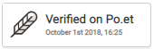

# WordPress Plugin

## Get an API Token

1. Go to [https://frost.poetnetwork.net](https://frost.poetnetwork.net).
2. Click on **Login / Sign Up**.
3. Under **Sign Up**, enter your email address and set a password.
4. Click on **Get API Token**.
5. Click on the pre-created API Token to copy it to your clipboard.
6. Save the API Token in a secure place (don't share it with anyone).

## Add Plugin

This tutorial assumes your are running WordPress version 4.9.8, but it should work with other versions too.

1. Login to your WordPress server as the admin user.
2. Go to **Plugins**, then click on **Add New**.
3. In the **Search plugins** box enter "Po.et".
4. Find the plugin in the results and click on **Install Now**.
5. Confirm the installation by going to **Plugins**, then click on **Installed Plugins**.
6. Under the Po.et plugin, click on **Activate**.
7. Then click on **Settings** and set the following:
    - Author Name: Fill in whatever name you want recorded in Po.et. It doesn’t have to match your WordPress blog.
    - API URL - Use https://api.poetnetwork.net/works. This is already filled in by default.
    - API Token - Enter the token you received above.
8. Make sure "Post articles automatically on insert or update?" is checked.
9. Click on **Save Changes**.

## Create a Post

1. Go to **Posts**, then click on **Add New**.
2. Write your post.
3. If you want to display a "Verified on Po.et" badge with your post, add the shortcode `[poet-badge]` in your post where you want the badge to appear.  

4. Click on **Publish**.

Your post is automatically registered on the Po.et Network!

If you included a badge in your post, you can click on it to see your registered work on the Po.et Explorer website, Po.et's app for exploring works registered on the Po.et Network. Please note it will take about 10 minutes for the work to be anchored to the Bitcoin blockchain, so you won't see your work in Explorer until that has happened.
